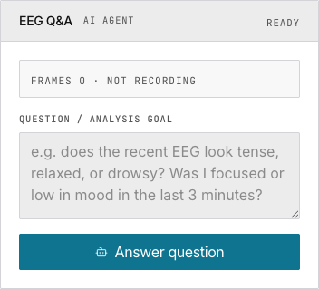

# 5. AI Analysis

> Connect an OpenAI-compatible LLM to analyze your five-band EEG features.



## Enable Recording

AI analysis requires five-band feature recording. On the Setup page, toggle **Record five-band features** ON, then start collection. Frames are saved to IndexedDB automatically.

## Choose a Provider

| Provider | Base URL | Needs API Key? |
|---|---|---|
| OpenAI | `api.openai.com/v1` | Yes |
| DeepSeek | `api.deepseek.com/v1` | Yes |
| Ollama | `localhost:11434/v1` | No |
| Custom | Your URL | Depends |

Click **Test model** to verify connectivity before running analysis.

## Ask a Question

Type a natural language question. Examples: "Does the recent EEG look tense or relaxed?" / "Was I focused in the last 3 minutes?" / "Compare alpha/beta between halves." Click **Answer question** — results stream in real time.

Response sections: **Reasoning** → **Evidence** → **Suggestions** → **Notes**.

## Running Locally with Ollama

```bash
ollama pull llama3
ollama serve
```

Configure provider "Ollama", model "llama3", leave API key empty. All data stays local.

## Under the Hood

Only pre-computed band power values (δ,θ,α,β,γ) are sent to the LLM. Raw 250 Hz waveform samples are never transmitted.

## Next

→ [Manage your AI conversations and recordings](/docs/freebci-daq/sessions)
→ [Read the full AI integration reference](/docs/freebci-daq/reference/ai-integration)
