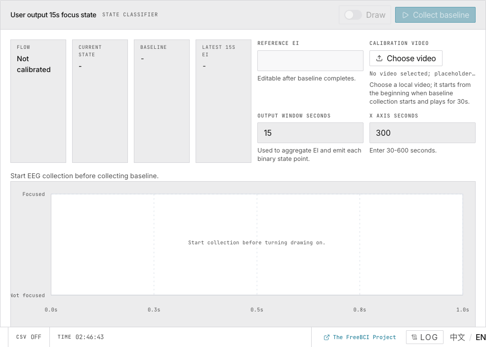

# 4. Engagement & Focus

> Track your Engagement Index (EI) in real time and calibrate a binary focus classifier.

## Engagement Index Trend

**EI = β / (α + θ)** — higher EI = more engaged.

| Element | Meaning |
|---|---|
| Blue line | EMA-smoothed EI |
| Red horizontal line | Alert threshold (default 0.3) |
| Red curve segment | EI below threshold |
| Δ 30S / 30S AVG | Change and average over last 30s |

FFT window: 2s (500 samples), hop: 0.5s, EMA α = 0.1. First 30s excluded. Reference: Pope et al. (1995).

## Focus Classification

A 4-state machine: **IDLE → Waiting Warmup (30s) → Collecting Baseline (15s) → Active**.

During baseline, choose a calibration video. The median EI is captured as the reference. Every decision window (default 15s), the current EI median is compared against the baseline → **Focused** or **Not focused**.

Reference EI is editable after baseline completes.

## Tuning

| Parameter | Default | Env Variable |
|---|---|---|
| Warmup | 30s | `VITE_FOCUS_WARMUP` |
| Baseline window | 15s | `VITE_FOCUS_BASELINE` |
| Decision window | 15s | `VITE_FOCUS_DECISION` |

## Next

→ [Ask AI to interpret your EEG data](/docs/freebci-daq/ai-analysis)
→ [Configure tuning parameters](/docs/freebci-daq/system-tuning)
