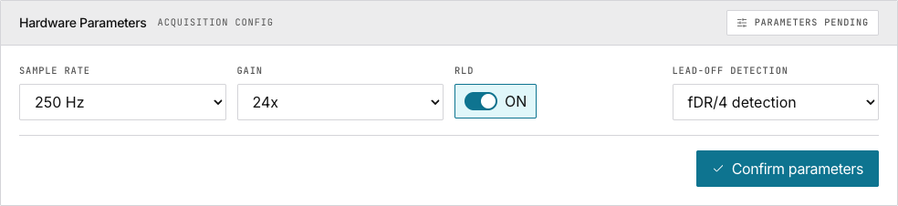
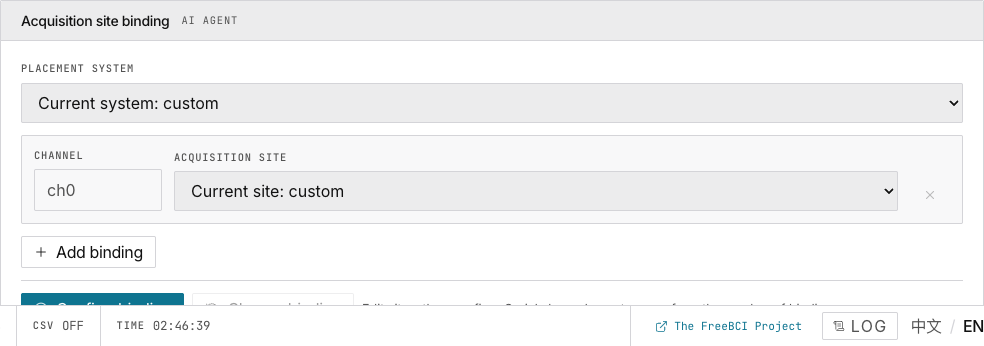
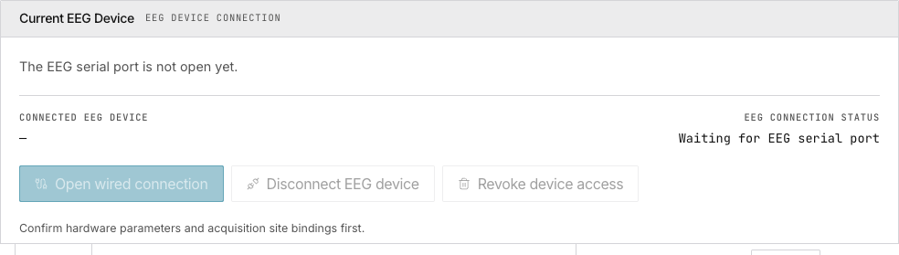
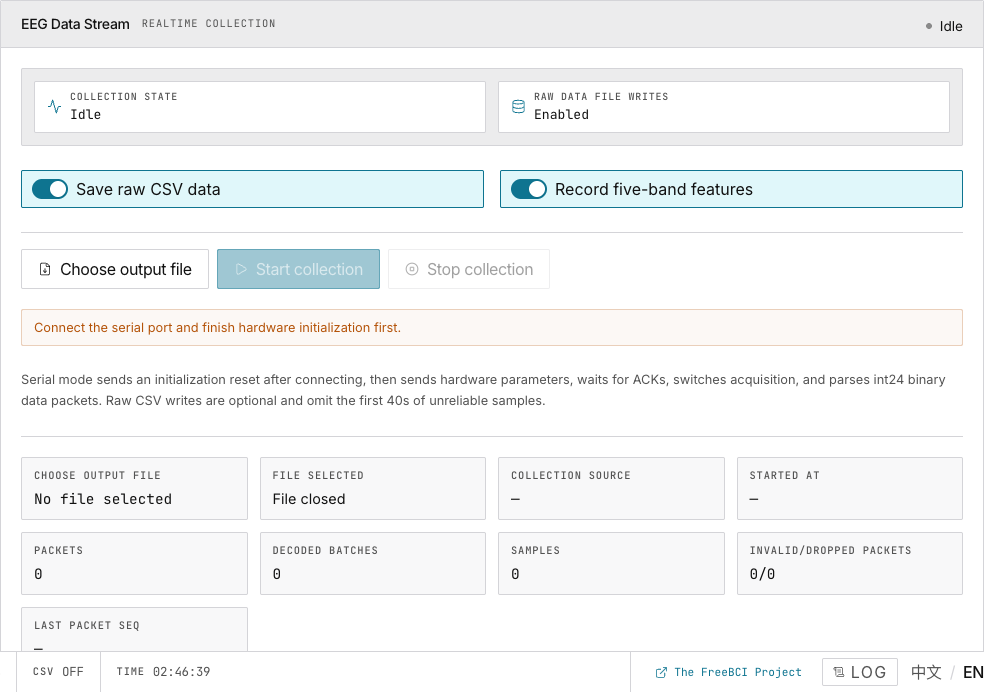
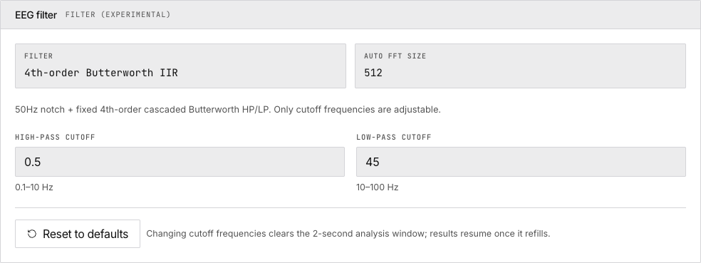

# 2. Hardware Setup

> Configure your EEG hardware parameters, bind electrode sites, and establish a stable serial connection.

## Hardware Parameters

| Parameter | Default | Description |
|---|---|---|
| Baud rate | 921600 | Serial communication speed |
| Sample rate | 250 Hz | Samples per channel per second |
| Gain | — | Amplifier gain setting |
| RLD | ON | Right leg drive for noise reduction |
| Lead-off detection | Off | Options: fDR/4, 7.8 Hz, 31.2 Hz |

Click **Confirm parameters**. The badge turns green: _Parameters locked_.

## Acquisition Site Binding

Maps electrode positions to data channels.

1. Select a **Placement system**
2. Click **Add binding** — creates a new channel row
3. Type the site name
4. Click **Confirm binding**

> **Note:** Only **ch0** is the effective EEG channel. The heatmap builds from rolling site records.

## Serial Connection

Both hardware parameters **and** site bindings must be confirmed before connecting.

Click **Open wired connection** → select device from browser dialog. The app sends `EEGRST` → `EEGCFG` → waits for ACKs.

Click **Disconnect EEG device** to close. Click **Revoke device access** to remove site permission.

## Data Stream

Click **Start collection** to begin sampling. Optional CSV output: toggle ON → choose file. First 30s excluded for device warmup.

Stream states: Idle → Starting → Collecting → Stalled (no packet for 2s).

## Filter Controls

4th-order Butterworth IIR band-pass filter. Adjust high-pass/low-pass cutoffs. **Changing cutoffs clears the FFT window.**

## Next

→ [Explore the live monitoring dashboard](/docs/freebci-daq/live-monitoring)
→ [Track your engagement & focus](/docs/freebci-daq/engagement-focus)
