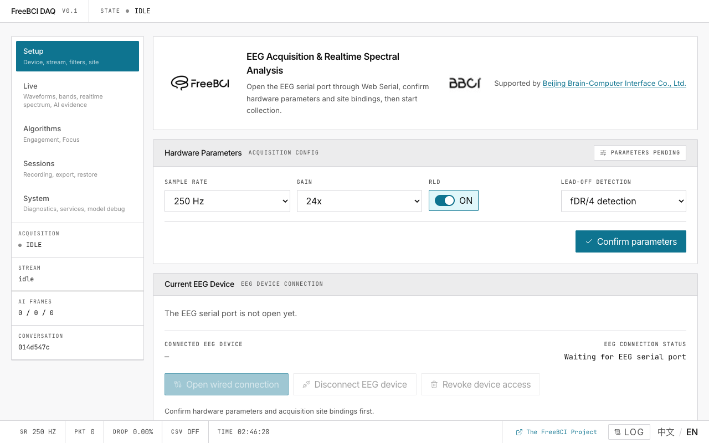

# FreeBCI DAQ

**Browser-based EEG acquisition & real-time spectral analysis.**

Connect your EEG hardware via USB, view brainwaves at 250 Hz, and get real-time engagement & focus metrics — all in your browser.

FreeBCI DAQ supports both:

- **FreeBCI Spike 1CH LH001** for onboarding, first-signal, and focus-demo workflows
- **FreeBCI Spike 8CH ADS1299** for fuller multichannel EEG workflows

## Tutorials

| # | Tutorial | What you'll do |
|---|---|---|
| 1 | [Quick Start](/docs/freebci-daq/quick-start) | Open the app → connect hardware → see waveforms in 5 minutes |
| 2 | [Hardware Setup](/docs/freebci-daq/hardware-setup) | Configure baud rate, gain, RLD, lead-off detection, site bindings |
| 3 | [Live Monitoring](/docs/freebci-daq/live-monitoring) | Read waveforms, compare spectra, watch band power trends |
| 4 | [Engagement & Focus](/docs/freebci-daq/engagement-focus) | Track your Engagement Index, calibrate focus detection |
| 5 | [AI Analysis](/docs/freebci-daq/ai-analysis) | Ask an LLM to interpret your EEG data |
| 6 | [Sessions](/docs/freebci-daq/sessions) | Manage recordings, export/import conversations |
| 7 | [System & Tuning](/docs/freebci-daq/system-tuning) | Read diagnostics, adjust processing parameters |
| 8 | **[Tuning Guide](/docs/freebci-daq/tuning-guide)** | Dial in EI, focus, and signal processing for your hardware |

## Reference

| Doc | Covers |
|---|---|
| [Data Pipeline](/docs/freebci-daq/reference/data-pipeline) | Architecture: serial → FFT → EI → focus |
| [Algorithms in Detail](/docs/freebci-daq/reference/algorithms-detail) | Math behind EI, EMA smoothing, FFT windows |
| [AI Integration](/docs/freebci-daq/reference/ai-integration) | OpenAI-compatible setup, five-band feature pipeline |
| [Configuration](/docs/freebci-daq/reference/configuration) | VITE_* env vars, tuning scenarios |
| [Developer Guide](/docs/freebci-daq/reference/developer-guide) | Codebase architecture, contributing |
| [Dev Tutorials](/docs/freebci-daq/reference/developer-guide) | Step-by-step coding tutorials |
| [Troubleshooting](/docs/freebci-daq/reference/troubleshooting) | Common errors and fixes |
| [FAQ](/docs/freebci-daq/reference/faq) | Frequently asked questions |

## Requirements

- **Chrome or Edge** (desktop) — Web Serial API required
- **localhost or HTTPS** — secure context required
- **FreeBCI hardware** with USB serial output at 921600 baud

All processing is local. No data leaves your browser.

Supported by [Beijing Brain-Computer Interface Co., Ltd.](https://www.bbci.net/en) · AGPL v3
