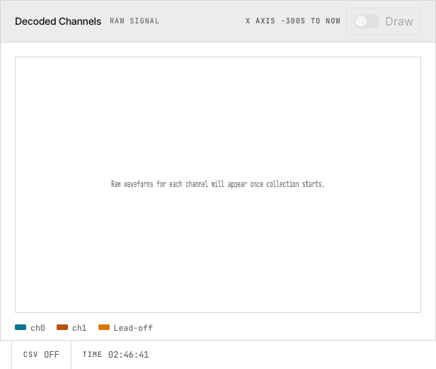
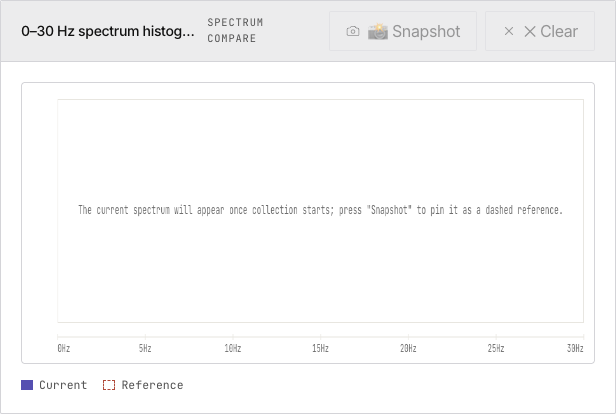
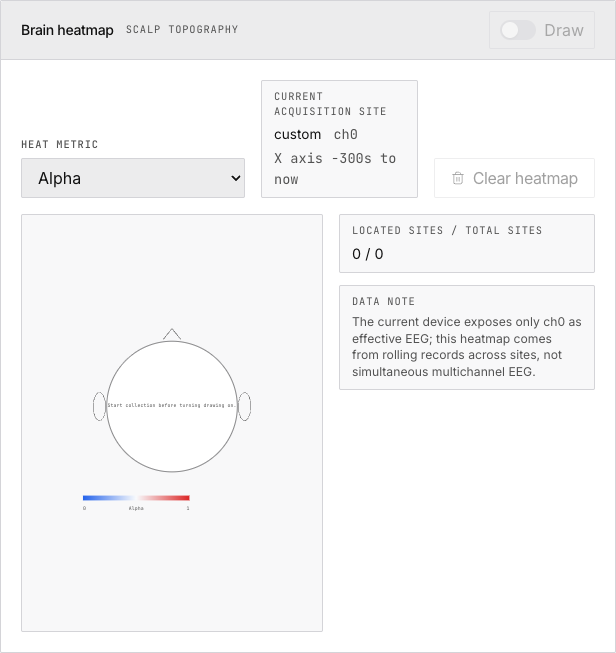
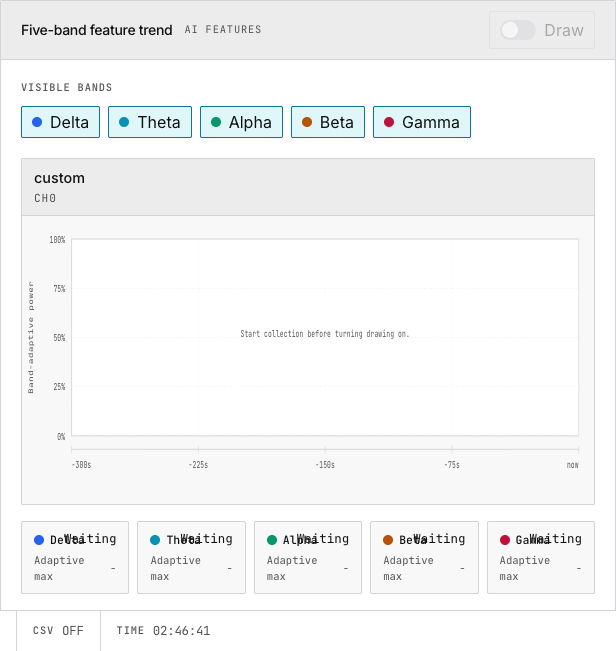

# 3. Live Monitoring

> Read raw and filtered waveforms, inspect the frequency spectrum, watch band power trends, and use the brain heatmap.

The Live page is a two-column dashboard: waveforms and charts on the left, AI analysis sidebar on the right.

## Waveform Panels

| Panel | Data Source | Use For |
|---|---|---|
| Raw Signal | Direct from serial parser | Checking signal quality |
| Filtered Signal | After 4th-order Butterworth IIR | Clean signal for analysis |

Controls: Y-axis range, channel selection, lead-off markers, tooltip on click/hover. Both panels use `requestAnimationFrame` → Canvas rendering for 60 fps.

## Spectrum Compare

0–30 Hz FFT magnitude as a bar histogram. Press **Snapshot** to pin the current spectrum as a dashed reference. Useful for comparing baseline vs. task states.

## Brain Heatmap

Scalp topography showing band power intensity at electrode positions. Switch the heat metric between Delta/Theta/Alpha/Beta/Gamma/EI. Builds up over time via rotating through acquisition sites (single-channel limitation).

## Five-Band Feature Trend

Time-series plots of delta, theta, alpha, beta, gamma band power. Each line is adaptively normalized per band within the X-axis window. Toggle individual bands on/off. These vectors feed the AI analysis pipeline.

## AI Analysis Sidebar

Configure an OpenAI-compatible LLM, ask questions about your EEG data. Requires five-band feature recording to be enabled on the Setup page.

## Bottom Status Bar

`SR 250` | `PKT` count | `DROP` count | `CSV` state | `TIME` elapsed | `Log` diagnostics | `EN` language toggle

## Next

→ [Track Engagement Index and calibrate focus detection](/docs/freebci-daq/engagement-focus)
→ [Ask an AI to interpret your EEG](/docs/freebci-daq/ai-analysis)
