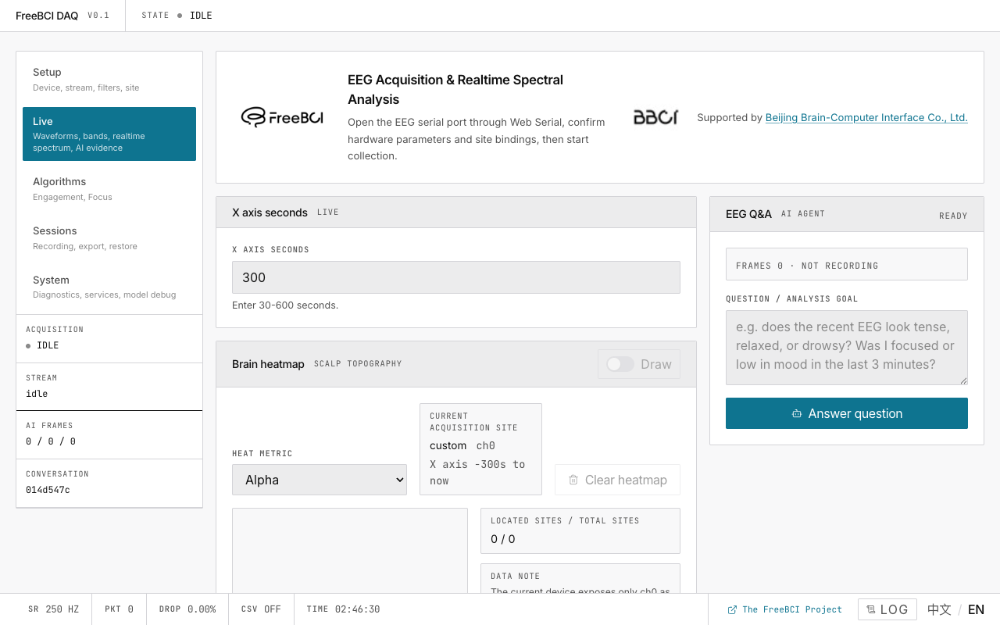

# 1. Quick Start

> Go from zero to live EEG waveforms in under 5 minutes.

## You'll Need

- **Chrome** or **Edge** on desktop (version 89+)
- Your EEG device connected via USB
- The app running on `localhost:5173` (or any HTTPS origin)

## Step 1: Confirm Hardware Parameters

Open the app. You land on the **Setup** page. The first card is **Hardware Parameters**.

1. Leave the defaults: **Baud rate 921600**, **Sample rate 250 Hz**
2. Click **Confirm parameters**
3. The badge turns green: **Parameters locked**

## Step 2: Add a Site Binding

Scroll down to **Acquisition site binding**.

1. Choose a placement system (e.g. **10-20 International**)
2. Click **Add binding** — each row is one channel
3. Type a site name (e.g. `Fp1`, `Cz`, `O1`)
4. Click **Confirm binding**

## Step 3: Open the Serial Port

1. Click **Open wired connection**
2. Select your EEG device from the browser dialog
3. Wait for the green **Connected** badge

## Step 4: Start the Data Stream

1. Click **Start collection**
2. The header badge changes to **STREAMING**
3. Bottom bar shows `SR 250`, `PKT` counting

## Step 5: Watch Your Brainwaves

Click the **Live** tab in the left sidebar.

You should see raw waveforms, filtered waveforms, and after 2 seconds — the spectrum histogram and EI trend appear.

## Next

→ [Configure hardware parameters in detail](/docs/freebci-daq/hardware-setup)
→ [Explore the live monitoring dashboard](/docs/freebci-daq/live-monitoring)
