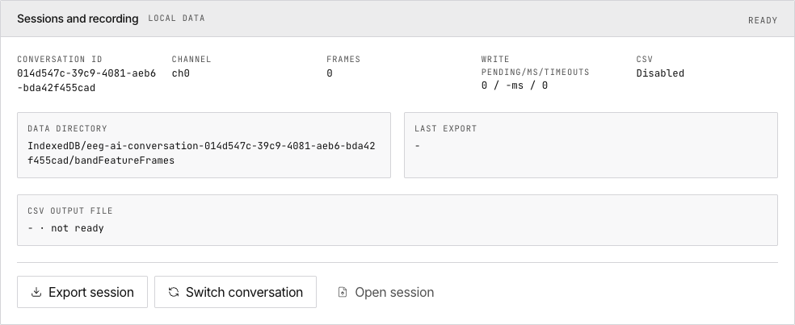

# 6. Sessions

> Manage AI conversations, export recordings, and control CSV output.

## Conversation Management

Each conversation bundles: five-band feature frames, AI analysis results, metadata. **Create**, **switch**, **export** (JSON bundle), and **import** conversations.

## CSV Output

Shows CSV toggle state and current output file. Enabled/Disabled. First 30s of streaming excluded from CSV.

## Data Storage

| Storage | What | Persists? |
|---|---|---|
| IndexedDB | Five-band frames, AI conversations | Yes |
| LocalStorage | Active tab, tuning overrides | Yes |
| Memory | Raw waveform samples (250 Hz) | No |
| CSV file | Raw data (optional) | On disk |

## Next

→ [Check diagnostics and tune parameters](/docs/freebci-daq/system-tuning)
→ [Configure parameters in detail](/docs/freebci-daq/reference/configuration)
