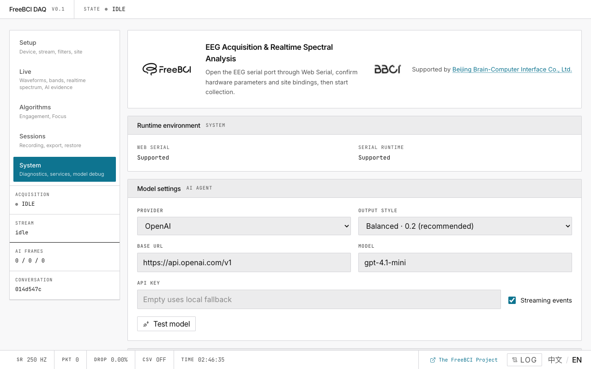
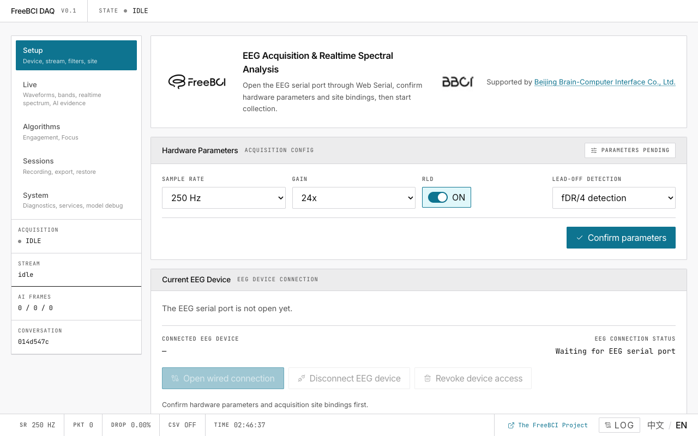
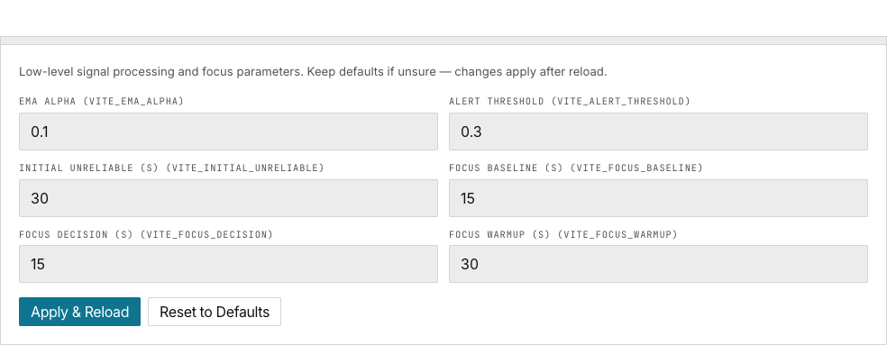

# 7. System & Tuning

> Check your runtime environment, read diagnostics, and adjust EEG processing parameters.

## Diagnostics

Click **Log** in the bottom bar or go to the System page. Each entry shows: phase, status, duration, message.

Common events: connection initialization, ACK responses, packet gaps, stall/recovery.

## Runtime Environment

Shows Web Serial support and serial runtime state. If "Not supported" → switch to Chrome/Edge.

## Advanced Tuning

Override `.env` variables at runtime via localStorage:

| Control | Default | What It Does |
|---|---|---|
| EMA Alpha | 0.1 | EI smoothing |
| Alert Threshold | 0.3 | EI red line |
| Initial Unreliable | 30s | Stream startup skip |
| Focus Baseline | 15s | Baseline window |
| Focus Decision | 15s | Output interval |
| Focus Warmup | 30s | Pre-baseline wait |

Adjust → **Apply & Reload**. **Reset to Defaults** clears all overrides.

Priority: Advanced Tuning > `.env` (VITE_*) > built-in defaults.

## Next

→ [Tune parameters for your hardware](/docs/freebci-daq/tuning-guide)
→ [Full configuration reference](/docs/freebci-daq/reference/configuration)
→ [Troubleshoot common issues](/docs/freebci-daq/reference/troubleshooting)
→ [Developer architecture guide](/docs/freebci-daq/reference/developer-guide)
