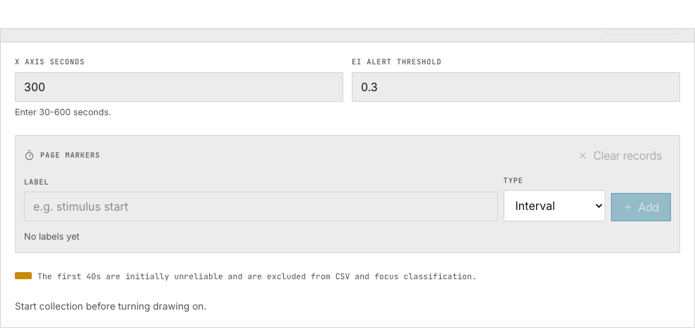
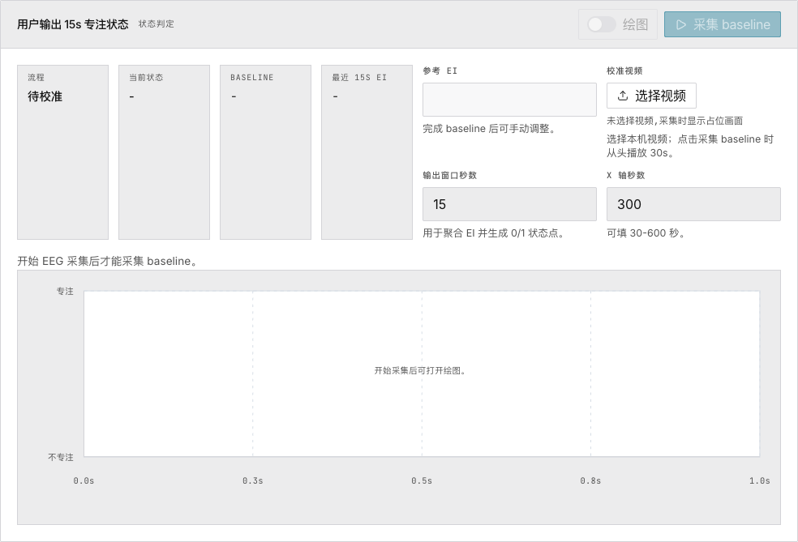

# 4. 参与度与专注度

> 实时追踪参与度指数（EI），校准二元专注度分类器。

## 参与度指数趋势

**EI = β / (α + θ)** — EI 越高，参与度越强。

| 元素 | 含义 |
|---|---|
| 蓝色曲线 | EMA 平滑后的 EI |
| 红色水平线 | 告警阈值（默认 0.3） |
| 红色曲线段 | EI 低于阈值 |
| Δ 30S / 30S AVG | 近 30 秒变化量和平均值 |

FFT 窗口：2 秒（500 样本），步长：0.5 秒，EMA α = 0.1。前 30 秒被排除。参考：Pope et al. (1995)。

## 专注度分类

四阶段状态机：**未校准 → 等待预热（30 秒）→ 采集基线（15 秒）→ 分类中**。

基线阶段可选择校准视频。系统获取基线的中位数 EI 作为参考值。每决策窗口（默认 15 秒）将当前窗口的 EI 中位数与基线对比 → **专注** 或 **不专注**。

基线完成后参考 EI 可手动修改。

## 参数配置

| 参数 | 默认值 | 环境变量 |
|---|---|---|
| 预热 | 30s | `VITE_FOCUS_WARMUP` |
| 基线窗口 | 15s | `VITE_FOCUS_BASELINE` |
| 判定窗口 | 15s | `VITE_FOCUS_DECISION` |

## 接下来

→ [让 AI 解读你的 EEG 数据](ai-analysis)
→ [配置调参](tuning-guide)
