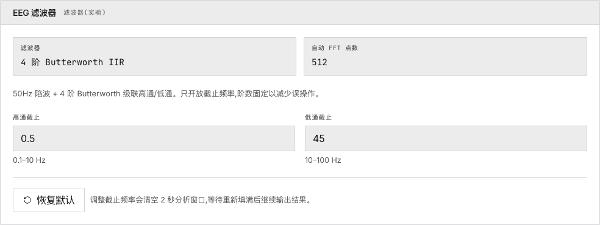

# 2. 硬件配置

> 配置 EEG 硬件参数、绑定电极点位、建立稳定的串口连接。

## 硬件参数

| 参数 | 默认值 | 说明 |
|---|---|---|
| 波特率 | 921600 | 串口通信速度 |
| 采样率 | 250 Hz | 每通道每秒采样数 |
| 增益 | — | 放大器增益设置 |
| RLD | ON | 右腿驱动降噪 |
| 导联脱落检测 | 关闭 | 可选：fDR/4、7.8 Hz、31.2 Hz |

点击 **确认参数**，徽章变绿：_参数已锁定_。

## 采集点位绑定

将电极位置映射到数据通道。

1. 选择 **电极放置系统**
2. 点击 **添加绑定** — 创建新的通道行
3. 输入点位名称
4. 点击 **确认绑定**

> **注意**：仅 **ch0** 为有效 EEG 通道。热力图通过滚动站点记录逐步构建。

## 串口连接

硬件参数和点位绑定必须**两者都确认**后才能打开串口。

点击 **打开有线连接** → 在浏览器对话框中选择设备。应用发送 `EEGRST` → `EEGCFG` 并等待 ACK 响应。

点击 **断开 EEG 设备** 关闭连接。点击 **撤销设备访问** 移除站点权限。

## 数据流

点击 **开始采集** 开始采样。可选 CSV 输出：切换开关为 ON → 选择文件。前 30 秒被排除，用于设备预热。

流状态：空闲 → 启动中 → 采集中 → 停滞（2 秒无有效包）。

## 滤波器控制

4 阶 Butterworth IIR 带通滤波器。可调整高通/低通截止频率。**更改截止频率会清空 FFT 窗口。**

## 接下来

→ [探索实时监测面板](live-monitoring)
→ [追踪参与度与专注度](engagement-focus)
