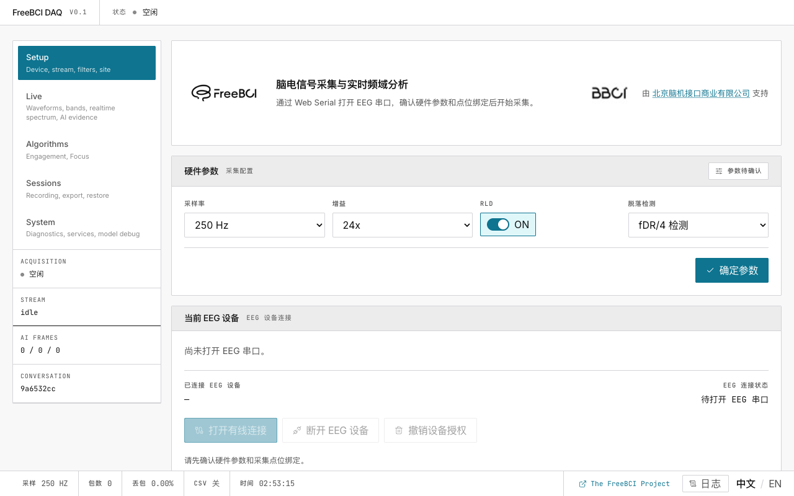

# FreeBCI DAQ

**浏览器端 EEG 脑电采集与实时频谱分析平台**

通过 USB 连接 EEG 硬件，在浏览器中实时查看 250 Hz 脑电波形，获取参与度与专注度指标。

## 使用教程

| # | 教程 | 你将学会 |
|---|---|---|
| 1 | [快速开始](./quick-start) | 打开应用 → 连接硬件 → 5 分钟看到脑电波形 |
| 2 | [硬件配置](./hardware-setup) | 配置波特率、增益、RLD、导联脱落检测、点位绑定 |
| 3 | [实时监测](./live-monitoring) | 阅读波形、对比频谱、查看频带趋势 |
| 4 | [参与度与专注度](./engagement-focus) | 追踪参与度指数、校准专注度分类 |
| 5 | [AI 分析](./ai-analysis) | 让大语言模型解读你的 EEG 数据 |
| 6 | [会话管理](./sessions) | 管理录制、导出/导入对话 |
| 7 | [系统与诊断](./system-tuning) | 查看诊断日志、调整处理参数 |
| 8 | **[调参指南](./tuning-guide)** | 针对你的硬件和场景，调出最佳效果 |

## 参考文档

| 文档 | 内容 |
|---|---|
| [数据流水线](./reference/data-pipeline) | 架构：串口 → FFT → EI → 专注度 |
| [算法详解](./reference/algorithms-detail) | EI 公式、EMA 平滑、FFT 窗口 |
| [AI 集成](./reference/ai-integration) | OpenAI 兼容接口、五频段特征管线 |
| [配置参考](./reference/configuration) | VITE_* 环境变量、调参场景 |
| [开发者指南](./reference/developer-guide) | 代码架构、开发规范 |
| [开发者教程](./dev/) | 手把手编码教程 |
| [故障排除](./reference/troubleshooting) | 常见错误与修复 |
| [常见问题](./reference/faq) | 常见问题解答 |

## 系统要求

- **Chrome 或 Edge**（桌面版） — 需要 Web Serial API
- **localhost 或 HTTPS** — 需要安全上下文
- **EEG 硬件** 通过 USB 串口输出，波特率 921600

所有数据处理均在本地浏览器中完成，不会上传任何数据。

由 [北京脑机接口商业有限公司](https://www.bbci.net/zh) 支持 · 遵循 AGPL v3 许可
