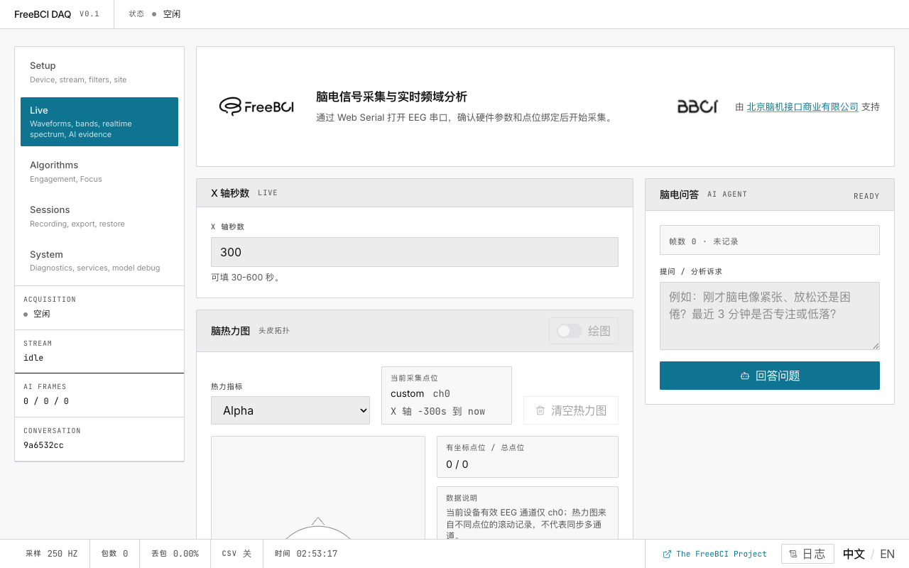

# 3. 实时监测

> 查看原始和滤波波形，检查频谱，观察频带功率趋势，使用脑区热力图。

Live 页面采用双栏布局：左侧为波形和图表，右侧为 AI 分析侧边栏。

## 波形面板

| 面板 | 数据来源 | 用途 |
|---|---|---|
| 原始信号 | 直接从串口解析器获取 | 检查信号质量 |
| 滤波信号 | 经过 4 阶 Butterworth IIR | 用于分析的干净信号 |

控制项：Y 轴范围调整、通道选择、导联脱落标记、点击/悬停查看精确值。两个面板均使用 `requestAnimationFrame` → Canvas 渲染，保证 60 fps 流畅度。

## 频谱对比

0–30 Hz FFT 幅度柱状图。按 **📸 快照** 固定当前频谱为虚线参考。用于对比基线状态与任务状态。

## 脑区热力图

头皮拓扑视图，展示各电极位点的频带功率强度。可在 Delta/Theta/Alpha/Beta/Gamma/EI 之间切换指标。

- 在 **1CH** 流程中，可将其视为简化的单点演示视图
- 在 **8CH** 流程中，请为每个采集通道绑定对应电极点位，以获得更完整的空间视图

## 五频段特征趋势

Delta、Theta、Alpha、Beta、Gamma 频带功率的时间序列图。每条线在 X 轴窗口内自适应归一化。可单独开关各频段。这些向量为 AI 分析管线提供输入。

## AI 分析侧边栏

配置 OpenAI 兼容的大语言模型，提问 EEG 相关问题。需要在设置页面开启五频段特征录制。

## 底部状态栏

`SR 250` | `PKT` 包计数 | `DROP` 丢包数 | `CSV` 状态 | `TIME` 运行时间 | `日志` 诊断 | `中文/EN` 语言切换

## 接下来

→ [追踪参与度指数和校准专注度](/zh/docs/freebci-daq/engagement-focus)
→ [让 AI 解读你的 EEG](/zh/docs/freebci-daq/ai-analysis)
