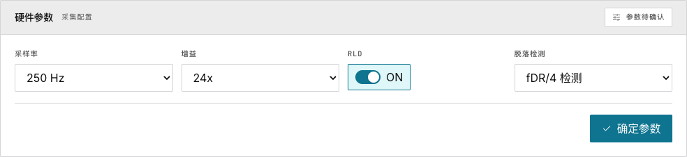
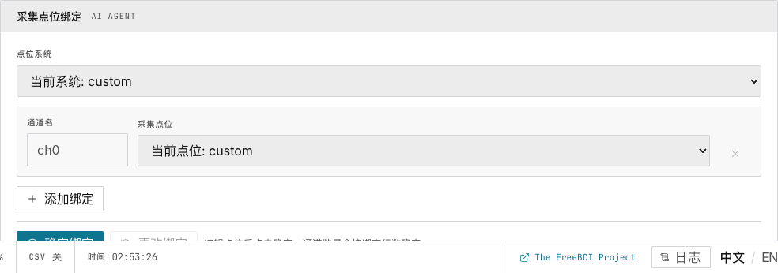
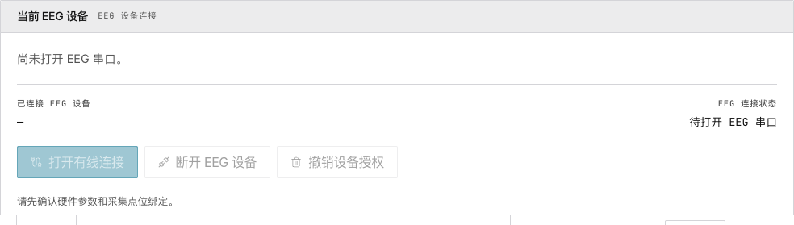
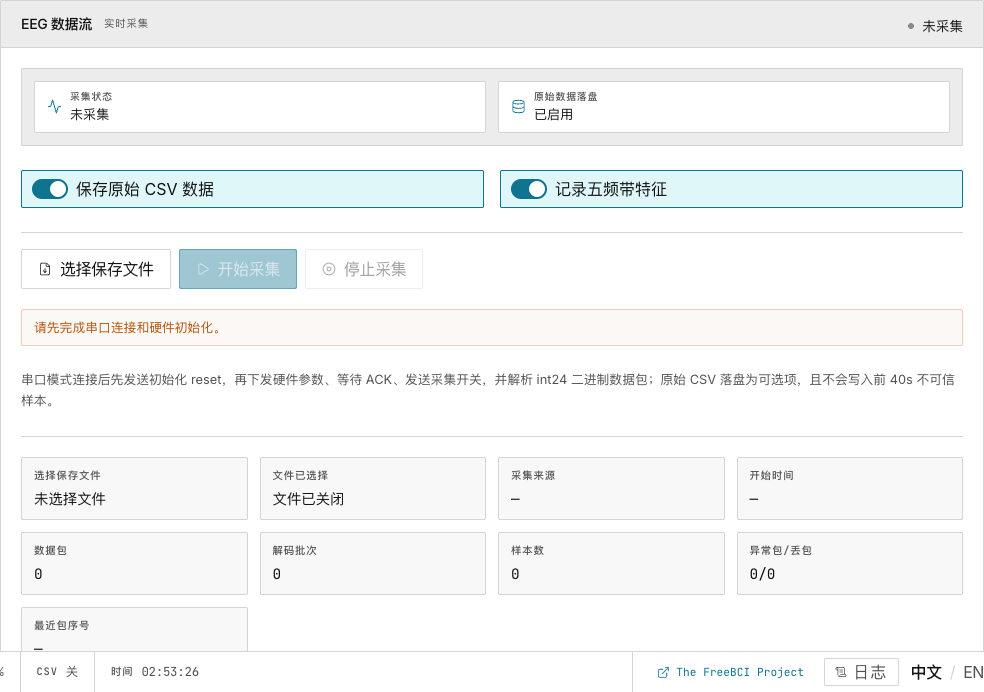

# 1. 快速开始

> 5 分钟内从零到看到实时脑电波形。

开始前，先选择你的硬件路径：

- [Spike 1CH LH001](/zh/docs/hardware/spike-1ch-lh001) 适合最快跑通专注度 / 参与度 Demo
- [Spike 8CH ADS1299](/zh/docs/hardware/spike-8ch-ads1299) 适合完整多通道 EEG 搭建

## 准备工作

- 桌面版 **Chrome** 或 **Edge**（89 版本以上）
- EEG 设备通过 USB 连接
- 应用运行在 `localhost:5173`（或任意 HTTPS 域名）

## 第一步：确认硬件参数

打开应用，默认进入 **Setup（设置）** 页面。第一个卡片是 **硬件参数**。

1. 保持默认值：**波特率 921600**、**采样率 250 Hz**
2. 点击 **确认参数**
3. 徽章变绿：**参数已锁定**

## 第二步：添加点位绑定

向下滚动到 **采集点位绑定**。

1. 选择电极放置系统（如 **10-20 国际标准**）
2. 点击 **添加绑定** — 每一行对应一个通道
3. 输入点位名称（如 `Fp1`、`Cz`、`O1`）
4. 点击 **确认绑定**

> **注意**：对于 **1CH**，一个已确认绑定就足够完成核心 Demo。对于 **8CH**，请为每个活动通道添加并确认绑定。

## 第三步：打开串口

1. 点击 **打开有线连接**
2. 在浏览器弹窗中选择你的 EEG 设备
3. 等待绿色 **已连接** 徽章

## 第四步：开始采集

1. 点击 **开始采集**
2. 顶部状态徽章变为 **采集中**
3. 底部状态栏显示 `SR 250`，`PKT` 开始计数

## 第五步：查看脑电波形

点击左侧边栏的 **Live** 标签。

你将看到原始波形、滤波波形，2 秒后频谱图和 EI 趋势也会出现。

## 接下来

→ [浏览 1CH / 8CH 硬件文档](/zh/docs/hardware)
→ [详细了解硬件配置](/zh/docs/freebci-daq/hardware-setup)
→ [探索实时监测面板](/zh/docs/freebci-daq/live-monitoring)
