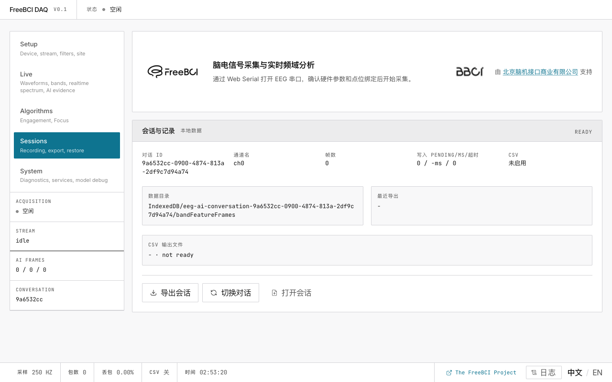

# 6. 会话管理

> 管理 AI 对话、导出录制、控制 CSV 输出。

## 对话管理

每个对话包含：五频段特征帧、AI 分析结果、元数据。可以**创建**、**切换**、**导出**（JSON 包）、**导入**对话。

## CSV 输出

显示 CSV 开关状态和当前输出文件。流的前 30 秒被排除。

## 数据存储

| 存储位置 | 内容 | 是否持久化？ |
|---|---|---|
| IndexedDB | 五频段特征帧、AI 对话 | 是 |
| LocalStorage | 当前标签页、调参覆盖 | 是 |
| 内存 | 原始波形样本 (250 Hz) | 否 |
| CSV 文件 | 原始数据（可选） | 磁盘上 |

## 接下来

→ [查看诊断和调参](system-tuning)
→ [详细配置参考](reference/configuration)
