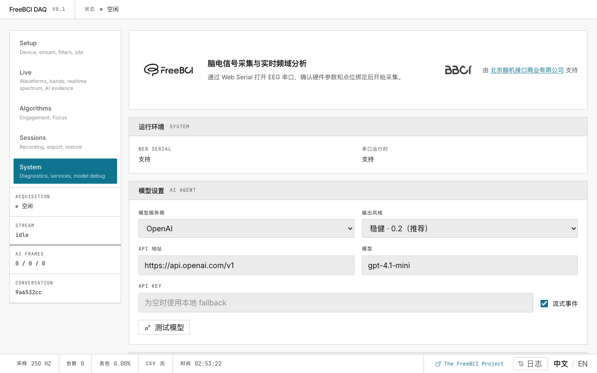
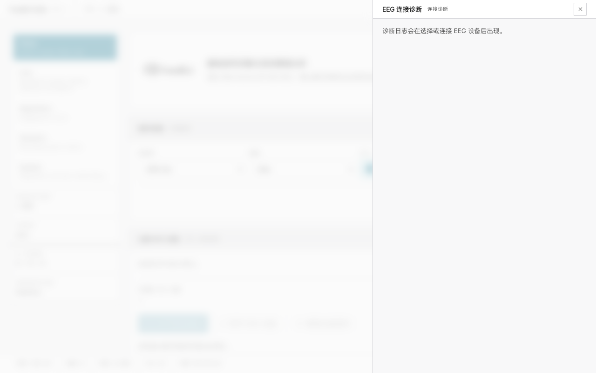

# 7. 系统与诊断

> 查看运行环境、阅读诊断日志、调整 EEG 处理参数。

## 诊断

点击底部状态栏的 **日志** 或进入系统页面。每条记录显示：阶段、状态、耗时、消息。

常见事件：连接初始化、ACK 响应、包丢失、停滞/恢复。

## 运行环境

显示 Web Serial 支持和串口运行时状态。如显示"不支持" → 切换至 Chrome/Edge。

## 高级调参

通过 localStorage 在运行时覆盖 `.env` 变量：

| 控制项 | 默认 | 作用 |
|---|---|---|
| EMA Alpha | 0.1 | EI 平滑度 |
| 告警阈值 | 0.3 | EI 红线 |
| 初始不可信期 | 30s | 流启动跳过的秒数 |
| 基线窗口 | 15s | 基线采集时长 |
| 判定窗口 | 15s | 输出间隔 |
| 预热等待 | 30s | 基线前等待 |

调整 → **应用并重载**。**恢复默认值** 清除所有覆盖。

优先级：高级调参 > `.env`（VITE_*）> 内置默认值。

## 接下来

→ [完整调参指南](/zh/docs/freebci-daq/tuning-guide)
→ [故障排除](/zh/docs/freebci-daq/reference/troubleshooting)
→ [开发者架构指南](/zh/docs/freebci-daq/reference/developer-guide)
