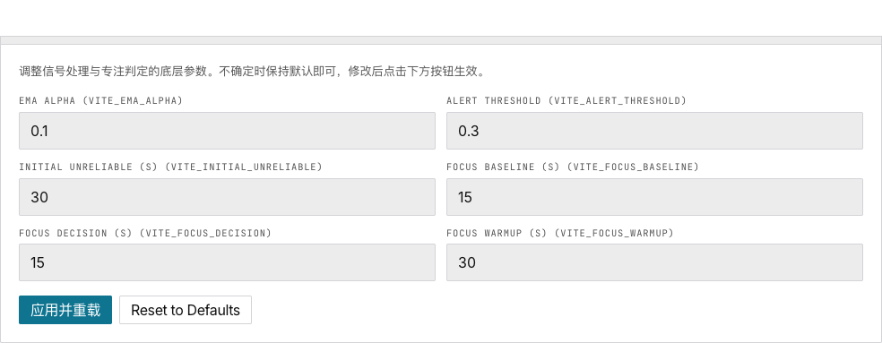

# 8. 调参指南

> 针对你的硬件和使用场景，调出最佳的参与度指数和专注度效果。

## 什么时候需要调参？

| 症状 | 需要调整的参数 |
|---|---|
| EI 曲线太抖、难以阅读 | 增大 **EMA Alpha** |
| EI 对精神状态变化反应太慢 | 减小 **EMA Alpha** |
| 告警触发太频繁或太少 | 调整 **告警阈值** |
| 专注基线感觉不稳定 | 增大 **基线窗口秒数** |
| 专注输出太频繁或太稀疏 | 调整 **判定窗口秒数** |
| 设备预热时间长 | 增大 **预热等待 / 初始不可信期** |

## 两种调参方式

### 方式一：环境变量（永久生效）

适合：部署到已知硬件、与团队共享配置。

```bash
cp .env.example .env
# 编辑 .env
npm run build
```

值被**烧入构建产物**，修改需要重新构建。

### 方式二：高级调参面板（运行时）

适合：实验、交互式调整参数。



1. 进入**系统**页面
2. 展开**高级调参**（点击箭头）
3. 调整滑块和输入框
4. 点击 **应用并重载** — 页面刷新，新值生效
5. 立即测试效果

值存储在 localStorage 中，覆盖 `.env` 和内置默认值。

---

## 参数详解

### EMA Alpha

**环境变量**：`VITE_EMA_ALPHA` · **默认**：`0.1` · **范围**：0.01 – 1.0

控制 EI 平滑度：

```
smoothEI = α × rawEI + (1 − α) × prevSmoothEI
```

| α | 效果 | 适用场景 |
|---|---|---|
| **0.05** | 非常平滑，约 20 个样本延迟 | 噪声大的硬件、慢速状态变化 |
| **0.10** | 平滑，约 10 个样本延迟 | **默认**，适合大多数场景 |
| **0.25** | 中等，约 4 个样本延迟 | 干净信号，想更快看到变化 |
| **0.50** | 响应快，约 2 个样本延迟 | 高信噪比硬件、快速检测 |

> **技巧**：从 0.1 开始。曲线太抖就调低，太迟钝就调高。

### 告警阈值

**环境变量**：`VITE_ALERT_THRESHOLD` · **默认**：`0.3` · **范围**：0.1 – 2.0

EI 趋势图中的红色水平线。当 EI 低于此值时曲线变红。

| 阈值 | 效果 | 适用场景 |
|---|---|---|
| **0.2** | 非常宽松，几乎不触发 | 仅在极端脱离时告警 |
| **0.3** | 宽松，明显脱离触发 | **默认** — 保守 |
| **0.5** | 中等，平衡 | 大多数用户调试后 |
| **0.7** | 严格，轻微下降即触发 | 高信噪比，需早期预警 |

### 初始不可信 / 预热等待

**环境变量**：`VITE_INITIAL_UNRELIABLE` + `VITE_FOCUS_WARMUP` · **默认**：`30` · **范围**：10 – 120

流启动后跳过的秒数，此期间数据不进入 CSV、EI 趋势和专注分类。

| 秒数 | 效果 |
|---|---|
| **20** | 快速启动，适合干净硬件 |
| **30** | 默认，适合大多数设备 |
| **60** | 保守，噪声大或慢稳定设备 |

> **关键**：`VITE_FOCUS_WARMUP` 必须与 `VITE_INITIAL_UNRELIABLE` **保持一致**。

### 基线窗口

**环境变量**：`VITE_FOCUS_BASELINE` · **默认**：`15` · **范围**：10 – 120

采集多少秒的 EI 数据来计算个人基线参考值（中位数）。

| 秒数 | 效果 |
|---|---|
| **15** | 快速校准 |
| **30** | 更稳定的基线 |
| **60** | 非常稳定 |

### 判定窗口

**环境变量**：`VITE_FOCUS_DECISION` · **默认**：`15` · **范围**：5 – 300

分类器每隔多少秒输出一次"专注"或"不专注"。

| 秒数 | 效果 |
|---|---|
| **10** | 频繁输出，短任务 |
| **15** | 默认 — 平衡 |
| **30** | 稀疏输出，长时间监测 |

---

## 场景配方

### A：噪声大的硬件

```bash
VITE_EMA_ALPHA=0.1          # 强平滑
VITE_ALERT_THRESHOLD=0.3    # 宽松触发
VITE_INITIAL_UNRELIABLE=60  # 长预热
VITE_FOCUS_WARMUP=60        # 必须一致
VITE_FOCUS_BASELINE=30      # 更长基线
VITE_FOCUS_DECISION=30      # 更长判定
```

**效果**：EI 曲线平滑，减少误报，启动较慢。

### B：高信噪比、快速响应

```bash
VITE_EMA_ALPHA=0.35         # 响应快
VITE_ALERT_THRESHOLD=0.6    # 严格触发
VITE_INITIAL_UNRELIABLE=20  # 快速启动
VITE_FOCUS_WARMUP=20        # 必须一致
VITE_FOCUS_BASELINE=15      # 快速基线
VITE_FOCUS_DECISION=10      # 频繁输出
```

**效果**：EI 灵敏，早期预警，校准快速。

### C：默认（通用）

```bash
VITE_EMA_ALPHA=0.1
VITE_ALERT_THRESHOLD=0.3
VITE_INITIAL_UNRELIABLE=30
VITE_FOCUS_WARMUP=30
VITE_FOCUS_BASELINE=15
VITE_FOCUS_DECISION=15
```

---

## 迭代策略

1. 从**场景 C**（默认值）开始
2. 采集 2-3 分钟，观察 EI 曲线
3. 太抖 → 增大 EMA Alpha
4. 告警过多 → 提高阈值
5. 基线不准 → 增大基线窗口
6. 每次只改一个参数，测试 2 分钟以上
7. 找到最佳值后保存到 `.env` 用于生产

不要一次修改多个参数，否则无法判断是哪个产生了效果。

## 接下来

→ [故障排除](reference/troubleshooting)
→ [完整配置参考](reference/configuration)
